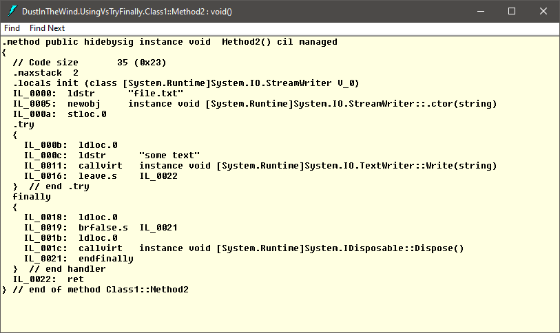
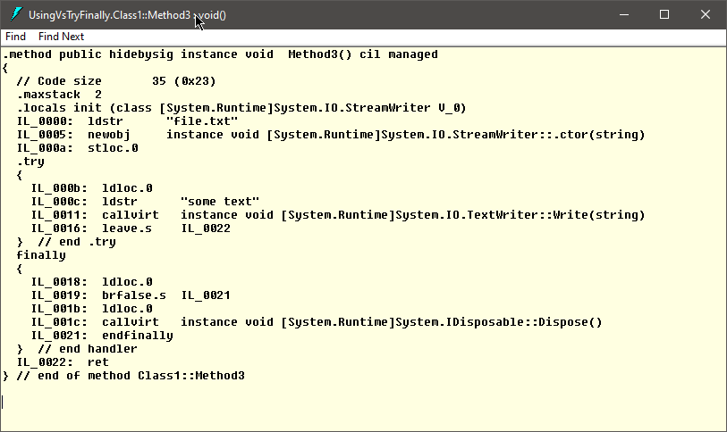

# `using` vs `try-finally`

## Problem Description

**Manually call `Dispose`**

If an object implements the `IDiposable` interface it is is, usually, a good practice to manually call its `Display` method as soon as the application does not need that object anymore. There are two main ways to do this:

- 1) explicitly - Actually call the `Dispose` method.
- 2) implicitly - Use a `using` block or a `using` declaration.

**Question**

Is there a functional difference between the `using` block, a `using` declaration and a `try-finally` block?

## 1) Explicitly call `Dispose`

### Simple call

If we have a disposable object, let's say a `StreamWriter`, we can call its `Dispose` method after we finished using it.

```csharp
StreamWriter streamWriter = new StreamWriter(@"file.txt");

// Write into the file

streamWriter.Dispose();
```

But this approach has a problem:

- If, while reading the content of the file, an exception is thrown, the `Dispose` method does not get to be executed.

### The `try-finally` block

To fix the previously described problem we can use a `try-finally` block like this:

```csharp
StreamWriter streamWriter = new StreamWriter(@"file.txt");

try
{
    // Write into the file
}
finally
{
    if (streamWriter != null)
        streamWriter.Dispose();
}
```

## 2) Implicitly call `Dispose`

### The `using` block

Another way to dispose the object is by using a `using` block.

The `using` block is automatically calling the `Dispose` method at the end of its execution.

```csharp
using (StreamWriter streamWriter = new StreamWriter(@"file.txt"))
{
    // Write into the file
}
```

### The `using` declaration (C# 8.0)

Starting with C# 8.0, we can use the `using` declaration. It does not have a bloc of its own and it calls the `Dispose` method at the end of the block into which it is declared.

```csharp
using StreamWriter streamWriter = new StreamWriter(@"file.txt");

// Write into the file
```

## Test

Let's take the previously presented examples of `try-finally` block, `using` block and `using` declaration put them in a C# project, compile them, and look at the generated IL.

### `Method1`: the `try-finally` block

```csharp
public void Method1()
{
    StreamWriter streamWriter = new StreamWriter(@"file.txt");
    try
    {
        streamWriter.Write("some text");
    }
    finally
    {
        if (streamWriter != null)
            ((IDisposable)streamWriter).Dispose();
    }
}
```

### `Method2`: the `using` block

```csharp
public void Method2()
{
    using (StreamWriter streamWriter = new StreamWriter(@"file.txt"))
    {
        // Write file content
        streamWriter.Write("some text");
    }
}
```

### `Method3`: the `using` declaration

```csharp
public void Method3()
{
    using StreamWriter streamWriter = new StreamWriter(@"file.txt");
    streamWriter.Write("some text");
}
```

### Decompiled with ILDASM

After we build the project in Release mode, we decompile it using ILDASM.

#### `Method1`


#### `Method2`



#### `Method3`



## Conclusion

There is no difference between the IL generated for a `try-finally` block, a `using` block and a `using` declaration.

> **Note**
>
> The `using` declaration will dispose the object only at the end of the current block (it may be the current method for example). If it is necessary to dispose the object earlier, before the method's end, a `using` block must be used instead.
